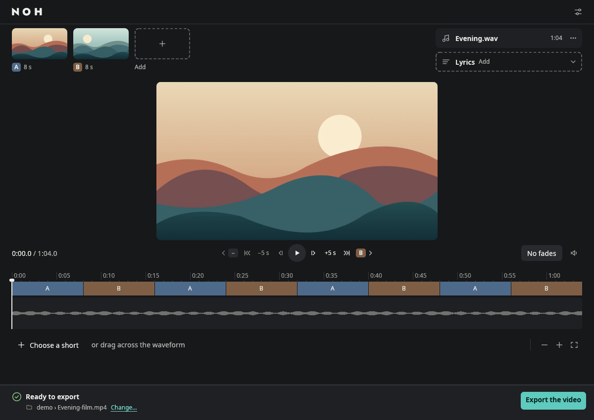

  

<h1 align="center">Your clips and photos, set to music.</h1>

  Arrange your media, add a song, preview the result and export a video. 
  NOH repeats your sequence to match the soundtrack, on one desktop screen.

  <a href="#download-and-install">Download &amp; install</a> ·
  <a href="docs/APP.md">First video</a> ·
  <a href="https://github.com/Awalgawe/noh/releases">Releases</a> ·
  <a href="docs/CHANGELOG.md">Changelog</a> ·
  <a href="docs/BUILDING.md">Build from source</a>

The Windows app with an illustrative project. Demo media was created for this screenshot.

## From a folder of media to a video

1. **Add your clips and photos.** Put them in the order you want.
2. **Drop in a WAV soundtrack.** Preview how the sequence fits the music.
3. **Export the video.** Or select a moment on the waveform for a vertical short.

### A few useful things, kept together

- **See and hear the result** in the built-in preview before exporting.
- **Add lyrics or captions** from an SRT file, or generate a local transcript and review it.
- **Keep compatible footage intact.** Video is copied without recompression where the composition allows it.
- **Work locally.** Your media is processed on your computer. The interface supports English, French, German, Spanish, Japanese, Korean and Simplified Chinese.

NOH is focused on repeating visual sequences, music and short extracts. It is not a general-purpose multitrack editor.

## Download and install

**[Download NOH for Windows](https://github.com/Awalgawe/noh/releases/latest)**

Choose **`NOH-<version>-windows-x64-Web-Setup.exe`** for guided installation.
It downloads the profile you choose:

| Profile | Included content |
| --- | --- |
| **Standard** | NOH, media tools and preview support for editing and exporting. |
| **Complete** | Standard plus local automatic transcription and its models. |
| **Minimal** | NOH only; add the media tools and transcription later. |

Each profile also has an offline installer. Minimal can offer additional downloads
during setup; an installed copy of NOH can add or repair missing components from
its resource settings, without uninstalling. Restart NOH after adding preview support.

A complete portable ZIP is also available: extract the entire
`NOH-<version>-windows-x64.zip`, then open `noh.exe`. Archives named `-materials.zip`
or `-installer-sources.zip` contain sources and build materials, not the app download.

If the Microsoft component needed for automatic subtitles is missing, the installer
offers to download it directly from Microsoft. In a portable copy, NOH provides a
**Download the Microsoft component** action. Install it, then choose **Check again**.
Preview, export and existing subtitles also work without that component.

This release was validated on Windows 10 x64 22H2 (build 19045). Read its notes
for checksums and validation limits. macOS and Linux currently require a
[source build](docs/BUILDING.md); macOS distribution signing and notarization
remain incomplete.

Follow the [installation guide](docs/INSTALLING.md) for setup, updates and removal,
then [make your first video](docs/APP.md#make-your-first-video).
See the [changelog](docs/CHANGELOG.md) for changes and known limits.

## Learn more

[Desktop guide](docs/APP.md) · [Command line](docs/CLI.md) ·
[Local MCP server](docs/MCP.md) · [Development](docs/DEVELOPMENT.md)

[Contributing](CONTRIBUTING.md) · [Security reports](SECURITY.md)

NOH's code is licensed under [GNU GPLv3](LICENSE) (`GPL-3.0-only`). Fonts and
third-party components retain their own licenses; see [credits and notices](docs/THIRD-PARTY.md).
